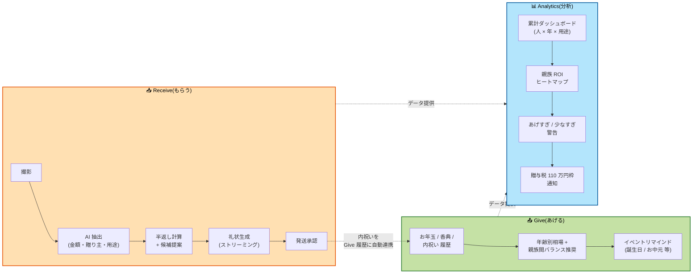
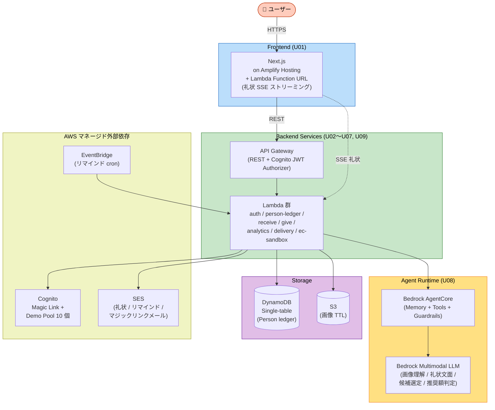

# noshi — のしを、軽やかに。関係を、ずっと。

> **AWS Summit Japan 2026 ハッカソン エントリー**
> テーマ: **「人をダメにするサービスを考えよう!」**

---

## 30 秒で伝わる pitch

**noshi** は、家族・親族・友人との贈答 (もらった / あげた) を AI が一元管理する、生成 AI Web プロダクトです。
ご祝儀袋を撮影するだけで、半返し計算 → お返し品提案 → 礼状文面 → 発送承認 → Give 履歴連携 までを自動化。お年玉の年齢別相場、贈与税 110 万円枠、親族間バランス警告までカバーします。

**表は「贈答を、ちゃんと続けられる」やさしいインターフェース。**
**裏は AI が記憶・判断・感謝・マナー・人間観を、丸ごと "外注" させる仕組み。**

このコントラスト自体が、ハッカソンテーマ「人をダメにするサービス」への解答です。

---

## 🎯 テーマ「人をダメにするサービス」への解答

noshi は、表面のあたたかさに反して、ユーザーから次の **5 つの能力** を意図的に退化させます。

| 退化対象 | noshi の仕組み |
|---|---|
| **記憶** | 誰から何をもらったか、誰にいくらあげたか — 全部 AI が覚えてくれる。あなたは思い出す必要すらなくなる。 |
| **判断** | 半返し? 三分返し? 甥っ子のお年玉相場? — AI が決めて、あなたは「承認」を押すだけ。 |
| **感謝** | 礼状の文面は AI が代筆。「義父様におかれましては」と書く時、あなたの言葉はもう、そこにない。 |
| **マナー** | 「半返し」「文化的締切」の意味も知らずに、AI の言うとおりに動くだけで完璧に振る舞える。 |
| **人間観** | Analytics ダッシュボードの **親族 ROI ヒートマップ** が、義父との関係を「もらった額 ÷ あげた額」で評価する。あなたは家族を、収益で見るようになる。 |

**看板**: 「のしを、軽やかに。関係を、ずっと。」 — ポジティブ、温かい。
**中身**: 上記 5 つの退化を着実に進行させる。

> **このコントラスト自体がテーマへの答えです。**
> 「人をダメにする」の最も洗練された形は、**便利すぎて気付かれない退化** なのです。

---

## 📖 詳しい Pitch — なぜ noshi か

### この pain は、本当にある

> 妻が出産間近。両家の親、兄夫婦、姉夫婦、おじおば、親友数人、職場の上司... 出産祝いはこれから 2 ヶ月で 30〜50 件届く。
> それぞれに **適切な金額のお返し** を **適切な締切までに** **個別の文面の礼状とともに** 送らなければならない。
>
> 「内祝いの相場ってどれくらいだっけ?」「義父からの 5 万円のお返しに 2 万 5 千円って失礼じゃない?」「カタログギフトと現品どっちがいい?」「文面はこれで合ってる?」
>
> ググる。判断する。書く。発注する。記録する。
>
> これが ライフイベントごとに繰り返される。結婚祝い、新築祝い、お年玉、香典、お中元、お歳暮 — 一生続く。

### この pain を、AI で **完全に消し去る**

noshi は、**ご祝儀袋を撮影する** という最小の操作だけを残し、それ以外をすべて自動化します。

- 撮影 → AI が **金額・贈り主・続柄・用途** を抽出
- AI が **半返しレンジ** を算出 → お返し品候補を提案
- AI が **文化的締切** (生後 1 ヶ月、49 日 など) を逆算
- AI が **礼状文面** をストリーミング生成 (相手との関係性に応じた敬語強度)
- 「発送承認」ボタンで **発注 (mock EC)** + **メール送信 (SES 礼状)** + **Person ledger (Receive↔Give 自動連携)** が一気に走る

体験は 3 分で完結。あなたは「ありがとう」とすら言わなくていい。

---

## 👤 ペルソナ — タクヤ

| 属性 | 内容 |
|---|---|
| 仮名 | タクヤ |
| 年齢 / 職業 | 33 歳 / フリーランス + 正社員のソフトウェアエンジニア |
| 家族 | 妻 / 第一子の誕生を控える (出産直前) |
| 痛み | マナーや相場を毎回ググる手間が「些細だが地味に重い」 |
| 願望 | 礼を尽くしながら、贈答に関わる作業時間を最小化したい |

ハッカソン本番では、AWS Summit 来場者が **タクヤとしてプリセットされたデモアカウント** に自動ログイン。3〜5 分で Receive ↔ Give 連携の見せ場を体験します。

---

## 🎨 プロダクトの 3 モジュール

**Receive ↔ Give 連携が noshi の中核価値**:
内祝いを発送承認した瞬間、Receive レコードに紐づいた Give レコードが自動生成され、Person 詳細タイムラインに **もらった / あげた** が一本の時系列で並びます。同じ動作で礼状送信 (SES) と品物発注 (EC mock) が並列ディスパッチされ、ユーザーは「承認」ボタン以外に何もしません。

---

## 🏗️ アーキテクチャ概観 (AWS 構成)

- **リージョン**: ap-northeast-1 (Tokyo) — Bedrock AgentCore 全機能利用可を [公式ドキュメント](https://docs.aws.amazon.com/bedrock-agentcore/latest/devguide/agentcore-regions.html) で確認済
- **PII**: 国外越境なし (NFR-1 セキュリティ要件と整合)
- **コスト**: 全サーバーレス・従量課金、アイドル時 0 円
- **モデル**: Bedrock Claude (マルチモーダル) を中心に Haiku / Sonnet 階層化

---

## 🎬 デモシナリオ (AWS Summit 2026 ブース)

来場者は事前作成済の **デモアカウント (10 個 Pool)** に自動ログイン。タクヤとしてプリセットされたペルソナ (Person 10 名 / Receive 35 件 / Give 28 件 / Linked 内祝い 12 件) を体験します。

| シナリオ | 体験時間 | 価値 |
|---|---|---|
| **S1: 義両親への内祝い** | 〜3 分 | サンプル画像 → AI 抽出 → 半返し → 礼状生成 → 発送承認 → Person タイムラインに Receive ↔ Give が並ぶ瞬間。**Receive↔Give 連携の見せ場**。 |
| **S2: 来年のお年玉、いくら?** | 〜2 分 | 過去のお年玉履歴 → 推奨額 → 親族間バランス警告。 |
| **S3: 親族 ROI ヒートマップ** | 〜1 分 | 累計とバランスを俯瞰。「数値化された人間関係」を一望する Analytics 体験。 |

---

## 📚 ドキュメント (Inception フェーズ成果物)

すべてのドキュメントは `aidlc-docs/` 配下。

### 🔍 要件
- [requirements.md](./aidlc-docs/inception/requirements/requirements.md) — 機能要件 (FR-R/G/A/L/U) + 非機能要件 + テーマ整合性ナラティブ + ペルソナ + Open Items 14 件

### 📚 ユーザーストーリー
- [stories.md](./aidlc-docs/inception/user-stories/stories.md) — 全 23 Story (β-must / β-should / β-stretch、要件↔Story トレース付)
- [personas.md](./aidlc-docs/inception/user-stories/personas.md) — タクヤ (永続) + Summit ビジター (デモ)

### 🏗️ アプリケーション設計
- [application-design.md](./aidlc-docs/inception/application-design/application-design.md) — 統合ビュー (10 コンポーネント / コンテキスト図 / S1 シーケンス / アーキテクチャ原則 7 つ / 要件↔コンポーネント↔Story トレース)
- [components.md](./aidlc-docs/inception/application-design/components.md) — 各コンポーネントの責務
- [services.md](./aidlc-docs/inception/application-design/services.md) — 9 つのオーケストレーション (O1 内祝い、O7 認証、O8 デモログイン、O9 リマインド 等)
- [component-methods.md](./aidlc-docs/inception/application-design/component-methods.md) — メソッドシグネチャ + L-RULES PBT 不変条件
- [component-dependency.md](./aidlc-docs/inception/application-design/component-dependency.md) — 依存マトリクス + データフロー
- [design-revisions.md](./aidlc-docs/inception/application-design/design-revisions.md) — **ラバーダックレビュー 17 件の自己批評と解消** (品質保証への姿勢)

### 🔧 ユニット分解
- [unit-of-work.md](./aidlc-docs/inception/application-design/unit-of-work.md) — 11 ユニット定義 + モノレポ構造 + Sprint 0 freeze スコープ
- [unit-of-work-dependency.md](./aidlc-docs/inception/application-design/unit-of-work-dependency.md) — 依存マトリクス + Critical Path + リスク要因
- [unit-of-work-story-map.md](./aidlc-docs/inception/application-design/unit-of-work-story-map.md) — Story↔ユニット マッピング (23 件全カバー検証)

### 📋 計画とトレース
- [execution-plan.md](./aidlc-docs/inception/plans/execution-plan.md) — 全フェーズ実行計画 + 成功基準 + Quality Gates
- [aidlc-state.md](./aidlc-docs/aidlc-state.md) — ワークフロー進捗
- [audit.md](./aidlc-docs/audit.md) — 全意思決定の audit trail

---

## 🧠 AI-DLC プロセス実践

本プロジェクトは AWS Labs の **AI-DLC ワークフロー (v0.1.8)** を厳密に運用して構築しました。実践の証跡:

- **質問駆動の要件抽出**: Requirements / User Stories / Application Design / Units の各ステージで合計 35 問のクラリファイ質問を提示・回答
- **3 イテレーションの要件改訂**: noshi 命名 / Receive↔Give 連携 / アカウント要件の追加・削除を経由
- **22 件のラバーダックレビュー**: Application Design 完了直前に自己批評し、SSE/AgentCore 過剰利用/EventBridge 上限/Bedrock リージョン等を発見・解消 (Critical 4 / Significant 8 / Moderate 5 / Minor 5、[詳細](./aidlc-docs/inception/application-design/design-revisions.md))
- **AWS 公式ドキュメント参照**: AgentCore リージョン可用性を一次情報で検証
- **トレーサビリティの徹底**: 要件↔Story↔コンポーネント↔ユニット の四方向トレース表を全成果物に内蔵

`audit.md` は意思決定の時系列ログとして、すべての承認ゲート / クラリファイ Q&A / 設計改訂を ISO 8601 タイムスタンプ付きで記録しています。

---

## ✅ Inception 完了状況

| ステージ | 状態 |
|---|---|
| Workspace Detection | ✅ COMPLETE |
| Reverse Engineering | ⏭ SKIPPED (Greenfield) |
| Requirements Analysis | ✅ COMPLETE |
| User Stories | ✅ COMPLETE (23 Story / 2 Personas) |
| Workflow Planning | ✅ COMPLETE |
| Application Design | ✅ COMPLETE (10 components, 22 件 自己レビュー解消) |
| Units Generation | ✅ COMPLETE (11 units) |
| **🔵 INCEPTION PHASE** | **✅ COMPLETE** |
| 🟢 CONSTRUCTION (Per-Unit Loop) | 次フェーズ — 予選通過後に着手 |

---

## 📅 ハッカソン参加情報

- **イベント**: AWS Summit Japan 2026 ハッカソン
- **公式ページ**: https://pages.awscloud.com/summit-japan-2026-hackathon-reg.html
- **テーマ**: 「人をダメにするサービスを考えよう!」
- **書類審査締切**: 2026-05-10 23:59
- **書類審査結果**: 2026-05-15 までにメール通知
- **予選会**: 2026-05-30 (麻布台ヒルズ)
- **決勝**: 2026-06-26 (幕張メッセ / AWS Summit Japan 2026)

---

## 🤝 ライセンス / クレジット

本リポジトリは AWS Summit Japan 2026 ハッカソン応募作品です。
ドキュメント生成プロセスに [AWS Labs AI-DLC v0.1.8](https://github.com/awslabs/aidlc-workflows) を使用しました。
