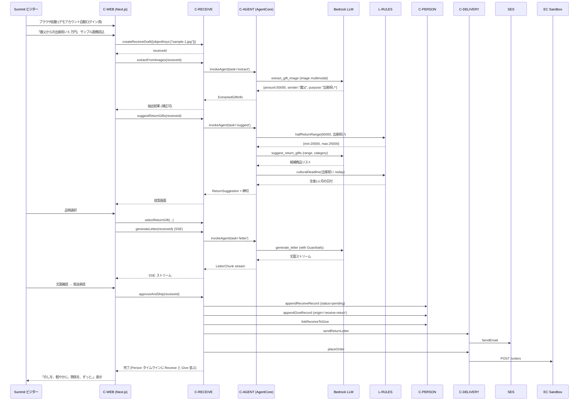

# Application Design — noshi (統合ドキュメント)

**プロジェクト**: noshi (AWS Summit 2026 Hackathon)
**ステージ**: INCEPTION / Application Design
**作成日**: 2026-05-10

> 本ドキュメントは Application Design の **統合ビュー** として、以下を 1 箇所に集約する:
> - 設計判断 (回答ベース) サマリ
> - コンテキスト図 / コンポーネント図 / シーケンス図 (S1 デモ)
> - 個別ドキュメントへのインデックス
> - 要件 ↔ コンポーネント / Story ↔ コンポーネント のトレーサビリティ
> - TBD 解決状況

詳細は以下を参照:
- `components.md` — コンポーネント識別と責務
- `component-methods.md` — メソッドシグネチャと型
- `services.md` — サービス境界とオーケストレーション
- `component-dependency.md` — 依存マトリクスと通信

---

## 1. 設計判断サマリ

| 判断 | 採用 | 影響 |
|---|---|---|
| Q1 フロント配信 | Next.js (SSR + API ルート) | Amplify Hosting / SSE が標準的に扱える |
| Q2 AgentCore 活用 | **LLM 判断のみ AgentCore** (旧「全活用」を再定義 — 詳細 design-revisions §C4) | 純粋計算は L-RULES 直呼び。AgentCore は画像理解 / 文面生成 / 候補選定 / 関係性推定 / 推奨額判定 のみ |
| Q3 文化ルール | ハイブリッド (コード + LLM) | L-RULES (純粋関数 / PBT) + C-AGENT の LLM ツール |
| Q4 OCR | Bedrock マルチモーダル ワンショット | extract_gift_image ツールが画像 → JSON を一発で |
| Q5 認証 | Cognito + マジックリンク | Cognito Custom Auth + Lambda Trigger + SES でリンク送信 |
| Q6 DB 構造 | DynamoDB Single-table | Person タイムラインを 1 クエリで返却 |
| Q7 発注 / 礼状 | SES (礼状) + EC サンドボックス | C-DELIVERY が両方を統括 |
| Q8 モノレポ + IaC | pnpm workspaces + AWS CDK (TS) | 言語統一、型共有、IaC も TS |

---

## 2. システムコンテキスト図 (Level 1)

```mermaid
flowchart TD
    User([👤 タクヤ / Summit ビジター])
    Noshi[noshi システム]
    Bedrock([Amazon Bedrock<br/>マルチモーダル LLM])
    Cognito([Cognito User Pool])
    SES_ext([SES])
    EC_ext([外部 EC サンドボックス API])

    User -->|HTTPS| Noshi
    Noshi -->|推論 / Guardrails| Bedrock
    Noshi -->|認証| Cognito
    Noshi -->|礼状/リマインド メール送信| SES_ext
    Noshi -->|品物発注 (ダミー)| EC_ext

    style Noshi fill:#FFE082,stroke:#F57F17,stroke-width:3px
    style User fill:#CE93D8
```

### Text Alternative

```
[👤 ユーザー (タクヤ / Summit ビジター)]
         │ HTTPS
         ▼
[noshi システム] ──→ [Bedrock マルチモーダル LLM] (推論 / Guardrails)
         ├──→ [Cognito User Pool] (認証)
         ├──→ [SES] (礼状 / リマインドメール)
         └──→ [外部 EC サンドボックス API] (品物発注ダミー)
```

---

## 3. コンポーネント図 (Level 2)

`component-dependency.md` のデータフロー図を参照。

要点:
- **Frontend**: C-WEB (Next.js) — Amplify Hosting
- **Backend サービス群** (API Gateway + Lambda): C-AUTH / C-PERSON / C-RECEIVE / C-GIVE / C-ANALYTICS / C-DELIVERY
- **Agent Runtime**: C-AGENT (AgentCore — Tools + Memory + Guardrails)
- **Storage**: DynamoDB Single-table (Person ledger) / S3 (画像 TTL)
- **External**: Cognito / Bedrock / SES / EC サンドボックス / EventBridge
- **共有ライブラリ**: L-RULES (純粋関数) / L-MODELS (型)

---

## 4. シーケンス図 — デモシナリオ S1 (US-22)

> Summit ビジターがサンプル画像をワンタップで読み込み、3 分以内で内祝い完了までを体験。



### Text Alternative

```
1. ビジター → C-WEB: ブラウザ起動 (デモアカウント自動ログイン済)
2. ビジター → C-WEB: サンプル画像「義父からの出産祝い 5 万円」読込
3. C-WEB → C-RECEIVE: createReceiveDraft → receiveId 受領
4. C-WEB → C-RECEIVE: extractFromImages
   → C-AGENT extract_gift_image → Bedrock マルチモーダル
   → 戻り: {金額: 50000, 贈り主: 義父, 用途: 出産祝い}
5. C-WEB → C-RECEIVE: suggestReturnGifts
   → C-AGENT calculate_return_range (L-RULES.halfReturnRange) → {min: 20000, max: 25000}
   → C-AGENT suggest_return_gifts (Bedrock LLM)
   → C-AGENT lookup_cultural_deadline (L-RULES.culturalDeadline) → 生後 1 ヶ月
6. ビジター → C-WEB: 品物選択 → selectReturnGift
7. C-WEB → C-RECEIVE: generateLetter (SSE)
   → C-AGENT generate_letter (Bedrock + Guardrails)
   → 文面ストリーム
8. ビジター → C-WEB: 発送承認
9. C-WEB → C-RECEIVE: approveAndShip
   ├─ C-PERSON に Receive 追加 (status=pending)
   ├─ C-PERSON に Give 追加 (origin=receive-return)
   ├─ link → status=returned
   ├─ C-DELIVERY → SES (礼状送信)
   └─ C-DELIVERY → EC Sandbox (発注)
10. C-WEB: 「のしを、軽やかに。関係を、ずっと。」表示
```

---

## 5. アーキテクチャ原則 (本プロジェクト固有)

> **改訂 (2026-05-10 ラバーダックレビュー反映)**: 原則の順序を入れ替え。Pure Rules First を最優先に格上げ、AgentCore First を「LLM Only」に再定義。

1. **Pure Rules First**: 計算で表現できる文化ルールは L-RULES の純粋関数として実装し PBT を適用。orchestration Lambda は L-RULES を直呼び。LLM (AgentCore 経由) は判断 / 文面 / 微妙ケースに限定。
2. **AgentCore for LLM Only**: AgentCore は **画像理解 / 文面生成 / 候補選定 / 関係性推定 / 推奨額の微妙な判定** のみに使う。純粋計算ルートには介在させない。Memory / Tools / Guardrails は本目的の範囲で活用。
3. **Person-Centric Persistence**: 永続データは Person を中核とした Single-table。Receive / Give は Person の子レコードとして保持し、タイムライン読み出しを 1 クエリ化。Analytics は事前集計キャッシュ (β 版は全件読みで割切も可、§10 参照)。
4. **Thin Lambdas, Shared Domain Package**: バックエンド Lambda は薄いオーケストレーション層。データアクセスは `@noshi/person-ledger` 等の workspace パッケージを通じて全 Lambda が共有 (§10 / `services.md` 横断参照)。
5. **Demo-Capable by Default**: デモアカウント自動ログイン (US-21) を一級市民として設計。**Pool 方式** (§12 参照) で他来場者と分離。
6. **Security at Boundary**: 認可は API Gateway + Lambda Authorizer (Cognito JWT) と Function URL の Lambda Authorizer。`userId` は全データアクセスの PK プレフィックスとして強制。`@noshi/auth-context` パッケージで型レベル強制。
7. **Cost-Conscious by Default**: 全サーバーレス・従量課金。アイドル時 0 円。デモパスは Provisioned Concurrency で UX 担保。

---

## 6. 要件 ↔ コンポーネント トレーサビリティ

| 要件 ID | 要件名 | 主担当コンポーネント |
|---|---|---|
| FR-R1 | 画像取り込み | C-WEB, C-RECEIVE, S3 |
| FR-R2 | 構造化抽出 | C-AGENT (extract_gift_image), Bedrock |
| FR-R3 | 関係性推定 | C-AGENT (estimate_relationship) |
| FR-R4 | 半返しレンジ | L-RULES.halfReturnRange |
| FR-R5 | お返し品候補 | C-AGENT (suggest_return_gifts) |
| FR-R6 | 文化的締切日 | L-RULES.culturalDeadline |
| FR-R7 | 発注 (承認) | C-DELIVERY (placeOrder) |
| FR-R8 | 礼状文面生成 | C-AGENT (generate_letter), Guardrails |
| FR-R9 | 受領記録 | C-PERSON (appendReceiveRecord) |
| FR-R10 | Receive→Give 自動連携 | C-RECEIVE (approveAndShip), C-PERSON |
| FR-G1 | 贈与履歴管理 | C-GIVE, C-PERSON |
| FR-G2 | 年齢別相場 | L-RULES.otoshidamaSuggestion |
| FR-G3 | 次回額推奨 | C-AGENT (recommend_amount) |
| FR-G4 | _(削除済)_ | — |
| FR-G5 | リマインド通知 | C-GIVE (schedule), EventBridge, C-DELIVERY (sendReminderMail), SES |
| FR-G6 | 内祝い統合表示 | C-PERSON.getTimeline |
| FR-G7 | 内祝い ↔ 元 Receive 遡り | C-GIVE.resolveSourceReceive, C-PERSON |
| FR-A1 | 累計ダッシュボード | C-ANALYTICS.getTotals |
| FR-A2 | ROI ヒートマップ | C-ANALYTICS.getRoiHeatmap |
| FR-A3 | バランス警告 | C-ANALYTICS.getBalanceWarnings, L-RULES.balanceWarning |
| FR-A4 | 110 万枠通知 | C-ANALYTICS.getTaxThresholdAlerts, L-RULES.taxThresholdStatus |
| FR-L1 | Person ledger | C-PERSON, DynamoDB Single-table |
| FR-L2 | Receive→Give 自動追加 | C-RECEIVE.approveAndShip → C-PERSON |
| FR-L3 | 統合タイムライン | C-PERSON.getTimeline |
| FR-L4 | Analytics 集計が ledger 参照 | C-ANALYTICS → C-PERSON |
| FR-L5 | お返し済 / 未対応 自動判定 | C-PERSON.linkReceiveToGive + listPendingReturns |
| FR-U1 | アカウント登録 | C-AUTH (magic link), Cognito |
| FR-U2 | データ分離 | 全 Lambda の userId PK 強制、API Gateway Authorizer |
| FR-U3 | アカウント削除 | C-PERSON.deleteAllUserData |
| FR-U4 | デモアカウント | C-AUTH.startDemoSession |
| FR-U5 | 認証セッション仕様 | C-AUTH (Cognito 標準) |

---

## 7. Story ↔ コンポーネント マッピング

| Story | 主担当コンポーネント |
|---|---|
| US-01 アカウント登録 | C-AUTH, C-WEB |
| US-02 自分情報セットアップ | C-WEB, C-PERSON (UserProfile 拡張) |
| US-03 Person 登録 | C-PERSON, C-WEB |
| US-04 画像アップロード | C-WEB, C-RECEIVE, S3 |
| US-05 構造化抽出 / 補正 | C-AGENT, C-RECEIVE, C-WEB |
| US-06 半返しレンジ + 候補 | C-AGENT, L-RULES, C-RECEIVE |
| US-07 文化的締切 | L-RULES, C-RECEIVE, C-WEB |
| US-08 礼状文面生成 | C-AGENT (Guardrails), C-RECEIVE (SSE), C-WEB |
| US-09 内祝い承認 + 連携 | C-RECEIVE, C-PERSON, C-DELIVERY |
| US-10 Person タイムライン | C-PERSON, C-WEB |
| US-11 未対応の俯瞰 | C-PERSON.listPendingReturns, C-WEB |
| US-12 贈与手動登録 | C-GIVE, C-PERSON |
| US-13 内祝い ↔ 元 Receive 遡り | C-GIVE.resolveSourceReceive, C-PERSON |
| US-14 次回額推奨 | C-AGENT (recommend_amount), L-RULES, C-GIVE |
| US-15 リマインド | C-GIVE, EventBridge, C-DELIVERY, SES |
| US-16 累計ダッシュボード | C-ANALYTICS, C-WEB |
| US-17 ROI ヒートマップ | C-ANALYTICS, C-WEB |
| US-18 バランス警告 | C-ANALYTICS, L-RULES |
| US-19 110 万枠通知 | C-ANALYTICS, L-RULES |
| US-20 アカウント削除 | C-PERSON.deleteAllUserData, C-AUTH |
| US-21 デモ自動ログイン | C-AUTH.startDemoSession |
| US-22 デモシナリオ S1 | 全 Receive 系 + C-AGENT + C-DELIVERY |
| US-23 デモ S2/S3 余力枠 | C-GIVE (recommend), C-ANALYTICS |

---

## 8. TBD 解決状況

| TBD ID | 項目 | このステージで確定したか | 結果 / 持ち越し先 |
|---|---|---|---|
| TBD-NAME | デモキャッチ最終採用 | 一旦採用 | メイン: 「のしを、軽やかに。関係を、ずっと。」 (UI コピーは User Stories〜Code Generation でも調整可) |
| TBD-R1 | 発注 — 実 EC vs モック | ✅ (改訂) | 自前 mock Lambda として `ec-sandbox-service` を立てる (design-revisions §M1) |
| TBD-R2 | 礼状の発送方法 | ✅ | SES によるメール送信 (Q7=C) |
| TBD-T1 | 画像 OCR 実装 | ✅ | Bedrock マルチモーダル ワンショット (Q4=A) |
| TBD-T2 | 文化ルールエンジン実装方式 | ✅ | ハイブリッド: L-RULES 純粋関数 (orchestration Lambda が直呼び) + LLM (AgentCore 経由、判断系のみ) — Q3=D を §C4 で再定義 |
| TBD-T3 | フロントエンドフレームワーク | ✅ | Next.js (Q1=B)。礼状ストリーミングは別途 Lambda Function URL で受ける (§C1) |
| TBD-U1 | 認証方式 | ✅ + Plan B | Plan A: Cognito + マジックリンク (Q5=C) / Plan B: Cognito Hosted UI 切替条件を Functional Design で明示 (§S5) |
| TBD-U2 | デモアカウント TTL ポリシー | ✅ | TTL 30 分 + 明示解放ボタン (§12) |
| TBD-T5 | 同時セッション上限 | 未確定 | NFR Design で確定 |
| TBD-T6 | 観測性スタック (X-Ray / AgentCore Observability) | 未確定 | NFR Design で確定 (§M4) |
| TBD-T7 | デモ時間外シャットダウン | 未確定 | Infrastructure Design で確定 |
| TBD-T8 | モジュール別 Bedrock モデル選定 | 未確定 | NFR Requirements / Code Generation で確定 |
| TBD-S1 | デモシナリオ最終構成 / サンプル画像 | 部分確定 (シーケンス図 §4 + データ規模 §14) | 残: サンプル画像準備 → Code Generation |
| TBD-S2 | ペルソナ事前データ規模 | ✅ | §14 で確定 (Person 10 / Receive 35 / Give 28 / Linked 12) |
| TBD-L1 | 税務助言誤認回避文言 | 未確定 | Functional Design / Code Generation で UI コピー確定 |
| TBD-L2 | 退化体感 UI コンテキスト表示 | ✅ (方針確定) | ROI ヒートマップ画面に「これは noshi の中で、唯一あなたを"ダメに"する機能です。意図的に。」を表示 (§m4)。最終文言は Functional Design / Code Generation |

---

## 9. Extension Compliance Summary (この設計時点)

| Rule | Status | Rationale |
|---|---|---|
| Security Baseline 全般 | Compliant | API Gateway Authorizer、userId PK 強制、Secrets Manager、画像 TTL、Guardrails を §5 アーキテクチャ原則と §services.md 横断関心事に明示 |
| Property-Based Testing (Partial) | N/A — 設計段階 | 適用は Code Generation 段階。L-RULES 全関数を PBT 対象として明示 |

---

## 10. Open Decisions Forwarded

設計上、後続ステージで詰めるべきことを再列挙:

1. **Functional Design (per-unit)**: 各サービスの詳細ロジック、エラーハンドリング、しきい値、バリデーション、デモパス分岐 (S1 ラバーダック §S1)、Cognito Custom Auth Trigger 実装と Plan B 切替条件 (§S5)、ROI ヒートマップ画面の退化体感 UI コピー (§m4)
2. **NFR Requirements / Design**: モデル選定 (Haiku vs Sonnet)、レート制限値、リトライポリシー (§m5)、タイムアウト、同時セッション上限、Aggregation キャッシュ実装の要否判断 (§S4)、AgentCore Observability の採用判断 (§M4)、Guardrails 閾値 (§M5)
3. **Infrastructure Design**: AWS リージョン (Tokyo 確定 §11)、Cognito UserPool 詳細、API Gateway / Function URL 設定、CDK スタック分割、デモ環境のシャットダウン戦略、EC mock Lambda 配線 (§M1)、デモアカウント Pool TTL (TBD-U2)
4. **Code Generation**: モノレポレイアウト確定 (`@noshi/*` パッケージ群)、各 Lambda の実装、L-RULES の関数群と PBT 不変条件の実装 (§S7)、AgentCore Agent の Prompt / Tools 実装 (LLM 判断系のみ §C4)、Next.js ページ実装 (Function URL ルート分岐 §C1)、Mermaid 検証 (§m1)
5. **Units Generation**: C-WEB / C-AGENT のサブユニット分解 (§M3)

---

## 11. Region & Compliance (新設)

> ラバーダックレビュー §C3 解決済。ソース: AWS 公式ドキュメント https://docs.aws.amazon.com/bedrock-agentcore/latest/devguide/agentcore-regions.html

### 11.1 採用リージョン
- **ap-northeast-1 (Tokyo)** を本プロジェクトの全 AWS リソースのリージョンとして採用。

### 11.2 ap-northeast-1 における AgentCore 機能可用性 (確認済)

| AgentCore 機能 | Tokyo |
|---|---|
| Runtime / Memory / Gateway / Identity / Built-in Tools / Observability / Policy / Evaluations / Agent Registry | ✅ |
| harness (preview) / payments (preview) | ❌ (本プロジェクト不要) |

→ **PII を国外越境させずに全機能を利用可能**。NFR-1 (個人情報の取り扱い) と整合。

### 11.3 採用しないリージョン / 越境
- 越境推論 (Cross-region inference) は採用しない (Tokyo で完結)。

---

## 12. Demo Account Isolation Strategy (新設)

> ラバーダックレビュー §C2 解決済。**A 案: デモアカウントプール方式** を採用。

### 12.1 概要
- Cognito User Pool に専用グループ `noshi-demo-pool` を作成。
- Pool 配下に **デモアカウントを 10 個事前作成** (`demo-001@noshi.example` 〜 `demo-010@noshi.example`)。
- 各アカウントには **ペルソナ事前データ (§14 参照)** が投入済み。
- ブースデバイスごとに Pool からアカウントを Lease (占有)。

### 12.2 Lease テーブル設計
```
Table: LeaseLock (DynamoDB)
PK: demoUserId (e.g., "demo-001")
attrs:
  - leaseDeviceId: string (occupying device)
  - leaseExpiresAt: epoch ms (TTL)
  - leaseStatus: 'available' | 'leased' | 'cleaning'
```

### 12.3 ライフサイクル
1. **Acquire**: Function URL `/auth/demo/start?deviceId=` → `available` の最初の Pool ユーザーを楽観ロック取得 → `leased` に遷移 → token 発行
2. **Active**: ユーザーが体験中 (TTL 30 分 or 「次の来場者へ」ボタン)
3. **Release**: TTL 切れ / 明示解放 → `cleaning` に遷移 → Cleaner Lambda 起動
4. **Reset**: Cleaner が当該 user 配下の DynamoDB アイテム削除 → 初期ペルソナデータ再投入 → S3 に紐付くアップロード画像削除 → `available` に戻す
5. **Pool 全空時**: フロントが「デモが満員です」表示

### 12.4 監視
- Pool の available 数を CloudWatch Metric として publish。残数 ≤ 2 になったらアラート。

---

## 13. Pre-launch Preparation Tasks (新設)

> ラバーダックレビュー §S2 解決済。本セクションは **コード実装に取りかかる前にやっておくべき準備作業**。

| # | タスク | 期限 | 担当 |
|---|---|---|---|
| 1 | **SES Production Access 申請** (sandbox 出る) | Application Design 承認直後 | リード |
| 2 | Bedrock Tokyo モデル (Haiku / Sonnet 等) の Model Access リクエスト | 本日中 | リード |
| 3 | ドメイン取得 + Route 53 + ACM 証明書 | Sprint 1 内 | インフラ担当 |
| 4 | DKIM / SPF / DMARC 設定 (SES 出した後すぐ) | SES 出次第 | インフラ担当 |
| 5 | Cognito User Pool 設定 (Custom Auth + Magic Link) | Sprint 1 序盤 | バックエンド担当 |
| 6 | デモアカウント Pool 作成スクリプト | Sprint 2 中盤 | バックエンド担当 |
| 7 | Mermaid Live Editor で全図を検証 | Code Generation 開始前 | 全員 |

---

## 14. Demo Data Specification (新設、TBD-S2 確定)

> ラバーダックレビュー §S8 解決済。各デモアカウント (Pool 全 10 個) には以下が事前投入される。

### 14.1 Person 一覧 (10 名)
| 続柄 | 仮名 | 備考 |
|---|---|---|
| 父 | タクヤの父 | — |
| 母 | タクヤの母 | — |
| 義父 | 義父 (S1 主役) | 出産祝い 5 万円を贈る (Receive) |
| 義母 | 義母 | — |
| 兄 | 兄 / 兄嫁 / 甥 (小学生) | お年玉サブシナリオの主役 |
| 姉 | 姉 / 姉夫 / 姪 (中学生) | お年玉サブシナリオの主役 |
| おじ | おじ A | — |
| おば | おば A | — |
| 親友 | 親友 1 | 結婚祝いを贈与済 |
| 親友 | 親友 2 | 出産祝い相手 |

### 14.2 Receive 一覧 (35 件)
| 用途 | 件数 | 備考 |
|---|---|---|
| 出産祝い | 8 | S1 デモのトリガはこの中の「義父 5 万円」 |
| 結婚祝い | 5 | 過去 (3 年前) |
| 新築祝い | 3 | 過去 (2 年前) |
| 香典 | 2 | — |
| お年玉 (もらった側) | 6 | 子ども時代分 |
| お中元 / お歳暮 | 6 | 過去 3 年分 |
| その他 | 5 | — |

### 14.3 Give 一覧 (28 件)
| 用途 | 件数 | 備考 |
|---|---|---|
| 内祝い (Receive 連携済) | 12 | Receive レコードと Linked |
| お年玉 | 8 | S2 デモシナリオの根拠データ |
| 香典 | 3 | — |
| 結婚祝い | 2 | — |
| その他 | 3 | — |

### 14.4 Linked Receive↔Give
- 12 件の内祝いペア (Receive 起点 → Give 自動連携を S1 が完了させて 13 件目になる、という見え方も狙える)

### 14.5 時系列分布
- 過去 3 年に分散
- 直近 3 ヶ月: お返し未対応の Receive を **意図的に 2 件残す** (US-11 の「未対応の俯瞰」を見栄え良くする)

