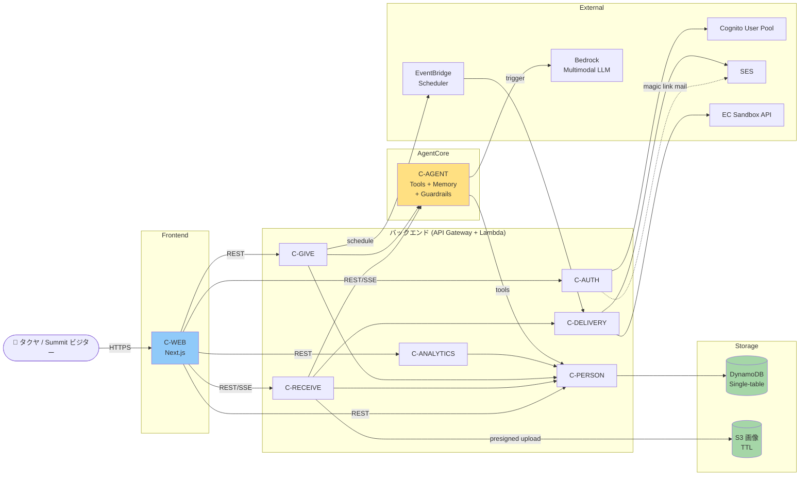

# Component Dependencies — noshi

依存マトリクスと通信パターン。

---

## 依存マトリクス (行: 呼ぶ側 / 列: 呼ばれる側)

| → 呼ばれる<br>↓ 呼ぶ | C-WEB | C-AUTH | C-PERSON | C-RECEIVE | C-GIVE | C-ANALYTICS | C-DELIVERY | C-AGENT | L-RULES | L-MODELS |
|---|---|---|---|---|---|---|---|---|---|---|
| **C-WEB** | — | ● HTTPS | ● HTTPS | ● HTTPS+SSE | ● HTTPS | ● HTTPS | (間接) | (間接) | (型のみ) | ● Build |
| **C-AUTH** | — | — | ◯ デモデータ初期化のみ | — | — | — | ● SES | — | — | ● Build |
| **C-PERSON** | — | — | — | — | — | — | — | — | (型のみ) | ● Build |
| **C-RECEIVE** | — | — | ● SDK | — | — | — | ● SDK | ● Bedrock SDK | (型のみ) | ● Build |
| **C-GIVE** | — | — | ● SDK | — | — | — | (間接 via Event) | ● Bedrock SDK | ◯ 一部直呼 | ● Build |
| **C-ANALYTICS** | — | — | ● SDK | — | — | — | — | (任意) | ● 直呼 | ● Build |
| **C-DELIVERY** | — | — | — | — | — | — | — | — | — | ● Build |
| **C-AGENT** | — | — | (Tool 経由) | — | — | — | — | — | ● Tool 内呼 | ● Build |
| **L-RULES** | — | — | — | — | — | — | — | — | — | ● Build |
| **L-MODELS** | — | — | — | — | — | — | — | — | — | — |

凡例: `●` 直接依存 / `◯` 間接 (イベント経由) / `(...)` 例外的経路

---

## 主要依存の補足

### C-WEB が触る対象
- **直接 HTTPS**: C-AUTH / C-PERSON / C-RECEIVE / C-GIVE / C-ANALYTICS (REST + SSE)
- **間接**: C-WEB は C-AGENT / C-DELIVERY を直接叩かない (バックエンドサービスがプロキシする)

### バックエンドサービス間の独立性 (§S6 で確定)
- **データアクセスは `@noshi/person-ledger` パッケージ経由**: DynamoDB アクセスロジック + 整合性ロジックを内包し、`userId` を必須引数とし型レベルで強制
- C-WEB からのリクエストは API Gateway → C-PERSON Lambda 経由 (REST API)
- 他 Lambda (C-RECEIVE / C-GIVE / C-ANALYTICS / C-AUTH(Cleaner)) は同パッケージを取り込んで **直接呼び出し**
- **直接 Lambda Invoke は使わない**: 疎結合維持のため。共有パッケージ取り込みで型安全性確保

### C-AGENT のデータ参照経路
- C-AGENT は Tool 内から **C-PERSON SDK / L-RULES** を呼ぶ
- C-AGENT は **C-WEB / C-RECEIVE / C-GIVE / C-ANALYTICS から呼ばれる**側 (受動的)

### EventBridge / SES の経路
- C-GIVE.scheduleReminder → **EventBridge スケジュール** → C-DELIVERY.sendReminderMail → SES

---

## データフロー図 (高レベル)

> Mermaid 形式 + テキスト代替を併記。



### Text Alternative (フォールバック)

```
👤 ユーザー
  └─→ C-WEB (Next.js)
        ├─→ C-AUTH ──→ Cognito User Pool
        │             └─→ SES (magic link mail)
        ├─→ C-PERSON ──→ DynamoDB single-table
        ├─→ C-RECEIVE
        │     ├─→ S3 (presigned upload)
        │     ├─→ C-AGENT ──→ Bedrock multimodal
        │     │              └─→ (tools) C-PERSON, L-RULES
        │     ├─→ C-PERSON
        │     └─→ C-DELIVERY ──→ SES, EC Sandbox API
        ├─→ C-GIVE
        │     ├─→ C-AGENT
        │     ├─→ C-PERSON
        │     └─→ EventBridge ──→ C-DELIVERY ──→ SES (リマインド)
        └─→ C-ANALYTICS
              └─→ C-PERSON
```

---

## 通信プロトコル & データ形式

> **改訂 (§C1, §S3, §S6, §M1 反映)**: SSE は Function URL 経由 / EventBridge は cron Rule 1 つだけ / Direct Lambda Invoke 不採用 / EC は自前 mock Lambda。

| ペア | プロトコル | データ形式 |
|---|---|---|
| ブラウザ ↔ C-WEB | HTTPS | HTML / JSON |
| C-WEB ↔ Lambda 群 (通常 API) | API Gateway REST (HTTPS) | JSON |
| C-WEB ↔ C-RECEIVE.generateLetterStream | **Lambda Function URL + Response Streaming** (HTTPS) | SSE event-stream (text/event-stream) |
| C-WEB ↔ C-AUTH.startDemoSession | Lambda Function URL | JSON |
| Lambda 内部 → DynamoDB | AWS SDK (`@noshi/person-ledger` 経由) | DynamoDB JSON |
| Lambda 内部 → S3 | AWS SDK / presigned URL | binary / JSON |
| Lambda 内部 → AgentCore | Bedrock AgentCore SDK (InvokeAgent) | AgentCore Invoke API JSON |
| AgentCore → Bedrock | AWS マネージド内部経路 | Bedrock マルチモーダル API |
| Lambda 内部 → SES | AWS SDK | SES SendEmail / SendTemplatedEmail |
| Lambda → ec-sandbox-service (Function URL) | HTTPS (内部) | JSON (mock 契約: `POST /orders → {orderId, status, expectedDelivery}`) |
| EventBridge cron Rule (1 つ) → ReminderDispatcher Lambda | EventBridge events | EventBridge event JSON |
| DynamoDB Streams → Aggregator Lambda (β-stretch) | AWS SDK | DynamoDB Streams record |
| SQS → Cleaner Lambda (デモ Lease 解放) | AWS SDK | SQS message JSON |

---

## 循環依存 / 結合のチェック

- **循環依存**: なし (すべて DAG)
- **結合の強さ**:
  - C-PERSON は最多のサービスから呼ばれる「核」コンポーネント。共有テーブルを介する読み書きが集中するため、Functional Design 段階で **データアクセス契約 (key 設計 / トランザクション境界)** を厳密に詰める
  - C-AGENT は AgentCore 1 リソースに集約。Tools の追加/変更は C-AGENT 内に閉じる
  - L-RULES は読み取り専用 (純粋関数のみ) のため結合は安全
