# Execution Plan — noshi

**作成日**: 2026-05-10
**プロジェクト**: noshi (AWS Summit 2026 Hackathon)
**プロジェクトタイプ**: Greenfield

---

## 1. Detailed Analysis Summary

### 1.1 Transformation Scope
- **N/A (Greenfield)** — 既存システムからの変換ではなく、新規構築

### 1.2 Change Impact Assessment

| 観点 | 該当 | 内容 |
|---|---|---|
| **User-facing changes** | Yes | 全ジャーニーが新規 UX (Receive / Give / Analytics / 来場者デモ) |
| **Structural changes** | Yes | 全アーキテクチャを新規定義 (Web フロント + サーバーレス API + AgentCore + DynamoDB Person ledger) |
| **Data model changes** | Yes | Person ledger を中核とした新規データモデル (Person / Receive / Give 統合 ledger) |
| **API changes** | Yes | 新規 API 群 (Receive 取り込み / 抽出 / 提案 / 礼状生成 / Give 操作 / Analytics 集計 / Account 管理) |
| **NFR impact** | Yes | NFR-1 セキュリティ / NFR-2 コスト / NFR-3 パフォーマンス / NFR-4 信頼性 全てに影響 |

### 1.3 Risk Assessment

| 項目 | 評価 |
|---|---|
| **Risk Level** | **Medium** |
| **Rollback Complexity** | Easy (greenfield、既存システムへの影響なし) |
| **Testing Complexity** | Moderate〜Complex (マルチモーダル AI / 文化ルール / デモ時間制約 / 公開環境 PII) |

**主要リスク要因**:
1. ハッカソン本番までの時間制約 (β 版完成必須)
2. マルチモーダル OCR 精度の不確実性 (TBD-T1 で実装方式選定)
3. 公開デモ環境での PII / プロンプトインジェクション (NFR-1 で対策必須)
4. 2〜4 名チームの並行作業のための疎結合化が必要

---

## 2. Workflow Visualization

```mermaid
flowchart TD
    Start(["User Request"])

    subgraph INCEPTION["🔵 INCEPTION PHASE"]
        WD["Workspace Detection<br/><b>COMPLETED</b>"]
        RE["Reverse Engineering<br/><b>SKIPPED (Greenfield)</b>"]
        RA["Requirements Analysis<br/><b>COMPLETED</b>"]
        US["User Stories<br/><b>COMPLETED</b>"]
        WP["Workflow Planning<br/><b>IN PROGRESS</b>"]
        AD["Application Design<br/><b>EXECUTE</b>"]
        UG["Units Generation<br/><b>EXECUTE</b>"]
    end

    subgraph CONSTRUCTION["🟢 CONSTRUCTION PHASE"]
        FD["Functional Design<br/>per-unit<br/><b>EXECUTE</b>"]
        NFRA["NFR Requirements<br/>per-unit<br/><b>EXECUTE</b>"]
        NFRD["NFR Design<br/>per-unit<br/><b>EXECUTE</b>"]
        ID["Infrastructure Design<br/>per-unit<br/><b>EXECUTE</b>"]
        CG["Code Generation<br/>(Planning + Generation)<br/><b>EXECUTE</b>"]
        BT["Build and Test<br/><b>EXECUTE</b>"]
    end

    subgraph OPERATIONS["🟡 OPERATIONS PHASE"]
        OPS["Operations<br/><b>PLACEHOLDER</b>"]
    end

    Start --> WD
    WD --> RE
    RE --> RA
    RA --> US
    US --> WP
    WP --> AD
    AD --> UG
    UG --> FD
    FD --> NFRA
    NFRA --> NFRD
    NFRD --> ID
    ID --> CG
    CG -.->|Next Unit| FD
    CG --> BT
    BT -.-> OPS
    BT --> End(["Complete"])

    style WD fill:#4CAF50,stroke:#1B5E20,stroke-width:3px,color:#fff
    style RA fill:#4CAF50,stroke:#1B5E20,stroke-width:3px,color:#fff
    style US fill:#4CAF50,stroke:#1B5E20,stroke-width:3px,color:#fff
    style WP fill:#4CAF50,stroke:#1B5E20,stroke-width:3px,color:#fff
    style CG fill:#4CAF50,stroke:#1B5E20,stroke-width:3px,color:#fff
    style BT fill:#4CAF50,stroke:#1B5E20,stroke-width:3px,color:#fff

    style RE fill:#BDBDBD,stroke:#424242,stroke-width:2px,stroke-dasharray: 5 5,color:#000

    style AD fill:#FFA726,stroke:#E65100,stroke-width:3px,stroke-dasharray: 5 5,color:#000
    style UG fill:#FFA726,stroke:#E65100,stroke-width:3px,stroke-dasharray: 5 5,color:#000
    style FD fill:#FFA726,stroke:#E65100,stroke-width:3px,stroke-dasharray: 5 5,color:#000
    style NFRA fill:#FFA726,stroke:#E65100,stroke-width:3px,stroke-dasharray: 5 5,color:#000
    style NFRD fill:#FFA726,stroke:#E65100,stroke-width:3px,stroke-dasharray: 5 5,color:#000
    style ID fill:#FFA726,stroke:#E65100,stroke-width:3px,stroke-dasharray: 5 5,color:#000

    style OPS fill:#FFF59D,stroke:#F57F17,stroke-width:2px,stroke-dasharray: 5 5,color:#000

    style INCEPTION fill:#BBDEFB,stroke:#1565C0,stroke-width:3px,color:#000
    style CONSTRUCTION fill:#C8E6C9,stroke:#2E7D32,stroke-width:3px,color:#000
    style OPERATIONS fill:#FFF59D,stroke:#F57F17,stroke-width:3px,color:#000

    style Start fill:#CE93D8,stroke:#6A1B9A,stroke-width:3px,color:#000
    style End fill:#CE93D8,stroke:#6A1B9A,stroke-width:3px,color:#000

    linkStyle default stroke:#333,stroke-width:2px
```



### Text Alternative (フォールバック)

```
🔵 INCEPTION PHASE
- Workspace Detection ............ COMPLETED
- Reverse Engineering ............ SKIPPED (Greenfield)
- Requirements Analysis .......... COMPLETED
- User Stories ................... COMPLETED
- Workflow Planning .............. IN PROGRESS
- Application Design ............. EXECUTE
- Units Generation ............... EXECUTE

🟢 CONSTRUCTION PHASE  (各ユニットに対し以下をループ)
- Functional Design (per-unit) ... EXECUTE
- NFR Requirements  (per-unit) ... EXECUTE
- NFR Design        (per-unit) ... EXECUTE
- Infrastructure Design (per-unit) EXECUTE
- Code Generation    (per-unit) .. EXECUTE  (Planning + Generation)
- Build and Test (全ユニット完了後) EXECUTE

🟡 OPERATIONS PHASE
- Operations ..................... PLACEHOLDER (将来拡張)
```

---

## 3. Phases to Execute

### 🔵 INCEPTION PHASE

- [x] **Workspace Detection** — COMPLETED
- [-] **Reverse Engineering** — SKIPPED
  - **Rationale**: Greenfield プロジェクト。既存コードなし。
- [x] **Requirements Analysis** — COMPLETED (3 イテレーション、最終承認済)
- [x] **User Stories** — COMPLETED (7 Epic / 23 Story、承認済)
- [x] **Workflow Planning** — IN PROGRESS (本ドキュメント)
- [ ] **Application Design** — **EXECUTE**
  - **Rationale**: 新規コンポーネント / サービス境界 (Web フロント / API / AgentCore / Person ledger / Auth / OCR ワーカー / 通知) を全て新規定義する必要がある。FR-L (Person ledger 連携) と FR-U (アカウント基盤) のドメイン境界決定が後続段階の前提。TBD-T2 (文化ルールエンジン実装方式)、TBD-T3 (フロントエンドフレームワーク)、TBD-U1 (認証方式) もここで決定する。
- [ ] **Units Generation** — **EXECUTE**
  - **Rationale**: 2〜4 名チームの並行作業を可能にするため、システムを疎結合なユニットに分解する必要がある。要件 §7.4 の暫定分割案 (フロント / AgentCore + ルールエンジン / Receive 画像処理 / Person ledger + Analytics / アカウント基盤) を実際の Units of Work として確定し、依存関係 / インターフェース契約 / 並行可能性を整理する。

### 🟢 CONSTRUCTION PHASE (各ユニットでループ)

- [ ] **Functional Design (per-unit)** — **EXECUTE**
  - **Rationale**: 複雑なビジネスロジックが多数存在する — 半返し / 三分返し計算 (US-06)、年齢別相場 + 親族間バランス推奨 (US-14)、Person ledger 整合性 (US-09 → US-13)、贈与税 110 万枠集計 (US-19)、文化的締切日算出 (US-07)。ユニットごとに精緻に設計する。
- [ ] **NFR Requirements (per-unit)** — **EXECUTE**
  - **Rationale**: NFR-1〜NFR-5 を満たすには、ユニットごとに具体値 (パフォーマンス目標 / セキュリティ脅威 / コストモデル / 信頼性パターン) を確定する必要がある。特に Bedrock モデル選定 (TBD-T8) はユニットごとに異なる。
- [ ] **NFR Design (per-unit)** — **EXECUTE**
  - **Rationale**: NFR Requirements を踏まえた設計パターン (リトライ / フォールバック / キャッシュ / レート制限 / Guardrails / シークレット参照) をユニットごとに具体化する。
- [ ] **Infrastructure Design (per-unit)** — **EXECUTE**
  - **Rationale**: 候補 AWS サービス (Bedrock / AgentCore / Cognito / API GW / Lambda / DynamoDB / S3 / EventBridge / SES / Secrets Manager / WAF / Amplify / CloudWatch) をユニットの責務に応じてマッピング・配線する必要がある。
- [ ] **Code Generation (per-unit)** — **EXECUTE (ALWAYS)**
  - **Rationale**: 実装段階。Part 1 で生成計画 → Part 2 で実装。Security Baseline 強制 / PBT (Partial) を半返し計算 / 推奨額計算等に適用。
- [ ] **Build and Test** — **EXECUTE (ALWAYS)**
  - **Rationale**: 全ユニットの統合 / E2E (デモシナリオ S1 通し) / セキュリティテスト / ロード耐性 / デモ時間制約 (3〜5 分完走) の最終確認。

### 🟡 OPERATIONS PHASE

- [ ] **Operations** — **PLACEHOLDER**
  - **Rationale**: 現行 AI-DLC 仕様では将来拡張用。デプロイ / 監視 / インシデント対応は CONSTRUCTION の Build and Test に最小限を含めて扱う。

---

## 4. Estimated Timeline (定性的)

ハッカソン本番までの定量的なカレンダー指定はないため、ステージ単位で見積:

| Phase | ステージ | 所要 (目安) |
|---|---|---|
| INCEPTION | Application Design | 1〜2 セッション |
| INCEPTION | Units Generation | 1 セッション |
| CONSTRUCTION (per-unit) | Functional Design + NFR Req + NFR Design + Infra Design + Code Gen | 5〜8 セッション × ユニット数 |
| CONSTRUCTION | Build and Test | 2〜3 セッション |
| **Total (推定 4〜5 ユニットの場合)** | | **22〜35 セッション** |

> ハッカソンの実際の開催日 / 締切は未確定 (TBD)。Workflow 上は β-must / β-should / β-stretch を優先順位として、時間切れ時は β-stretch から順にカット。

---

## 5. Success Criteria

### 5.1 Primary Goal
AWS Summit 2026 ハッカソンに向け、noshi の β 版を完成させ、デモシナリオ S1 (内祝い) を 3 分以内に完走できる状態にする。

### 5.2 Key Deliverables

| カテゴリ | 成果物 |
|---|---|
| **アプリケーション** | Web フロント / バックエンド API / AgentCore エージェント / Person ledger / 認証基盤 |
| **デモ** | プリセット済デモアカウント + サンプル画像 + デモシナリオ S1 (S2/S3 余力枠) |
| **テスト** | ユニット / インテグレーション / E2E デモ通し / PBT (Partial: 半返し / 相場推奨 / 110 万枠計算 / Person ledger 整合) |
| **セキュリティ** | Security Baseline 強制 / Guardrails / PII 処理 / レート制限 |
| **ドキュメント** | Requirements / Stories / Design / Functional / NFR / Infra / 実装メモ — すべて日本語 |

### 5.3 Quality Gates

| Gate | 条件 |
|---|---|
| **G1: Application Design 承認** | 全コンポーネント / サービス境界が明示され、ユーザーが承認 |
| **G2: Units Generation 承認** | 並行作業可能なユニットに分割され、依存と契約が明示 |
| **G3: Per-Unit Design 承認** | 各ユニットの Functional / NFR / Infrastructure Design が個別に承認 |
| **G4: Per-Unit Code 承認** | 各ユニットのコード生成計画と実装が個別に承認 |
| **G5: Build and Test 完了** | 全ユニット統合 / E2E S1 完走 / セキュリティチェック合格 |

---

## 6. Extension Configuration (再掲)

| Extension | Enabled | 適用ステージ |
|---|---|---|
| Security Baseline | Yes | NFR Requirements / NFR Design / Code Generation / Build and Test 全てで強制 |
| Property-Based Testing | Partial | Code Generation (純粋関数 / シリアライズ) / Build and Test (PBT 実行) |

---

## 7. Open Items / Carried Forward (要件文書 §12 から継承)

主要な TBD は **Application Design** で扱われる予定:
- TBD-NAME (デモキャッチ最終採用) / TBD-R1 (発注 EC vs モック) / TBD-R2 (礼状発送方法) / TBD-T1 (OCR 実装方式) / TBD-T2 (文化ルールエンジン方式) / TBD-T3 (フロントエンドフレームワーク) / TBD-U1 (認証方式) / TBD-U2 (デモアカウント TTL) / TBD-S1 (S1〜S3 構成 + サンプル画像) / TBD-S2 (ペルソナ事前データ規模) / TBD-L1 (税務助言誤認回避文言) / TBD-L2 (退化体感の UI コンテキスト)

**NFR Design / Infrastructure Design** で扱う TBD:
- TBD-T5 (同時セッション上限) / TBD-T6 (観測性スタック) / TBD-T7 (デモ時間外シャットダウン要否) / TBD-T8 (モジュール別 Bedrock モデル選定)
